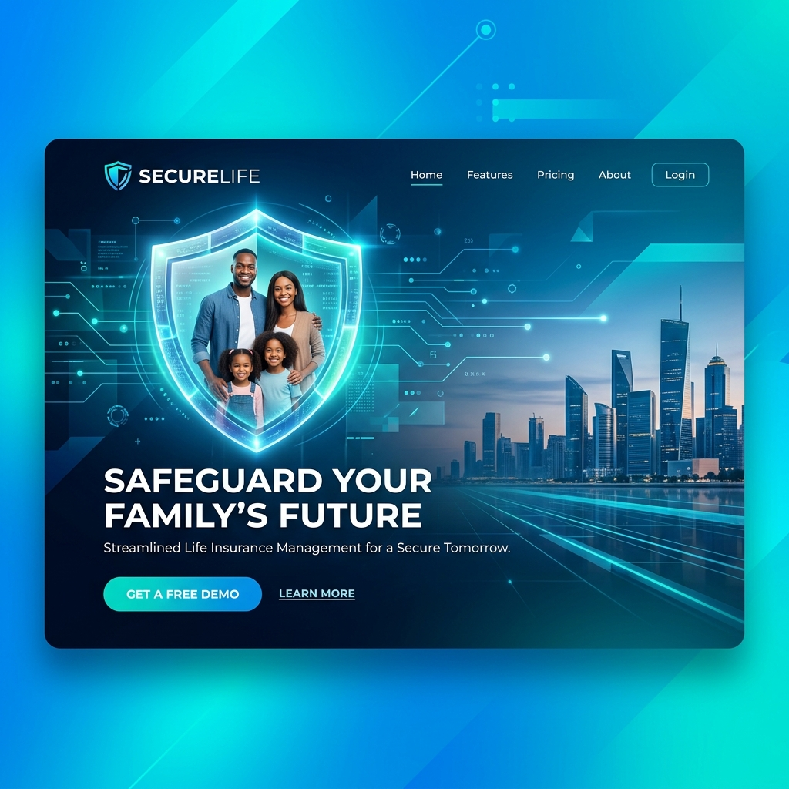
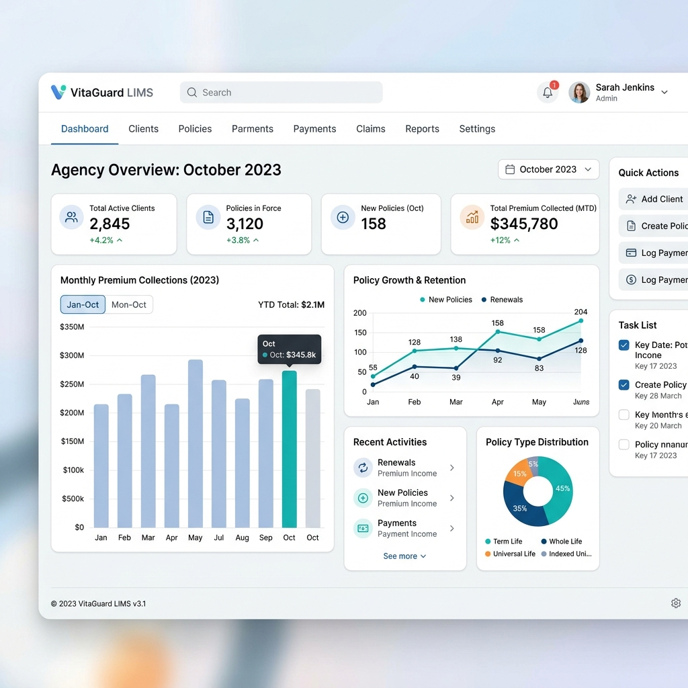
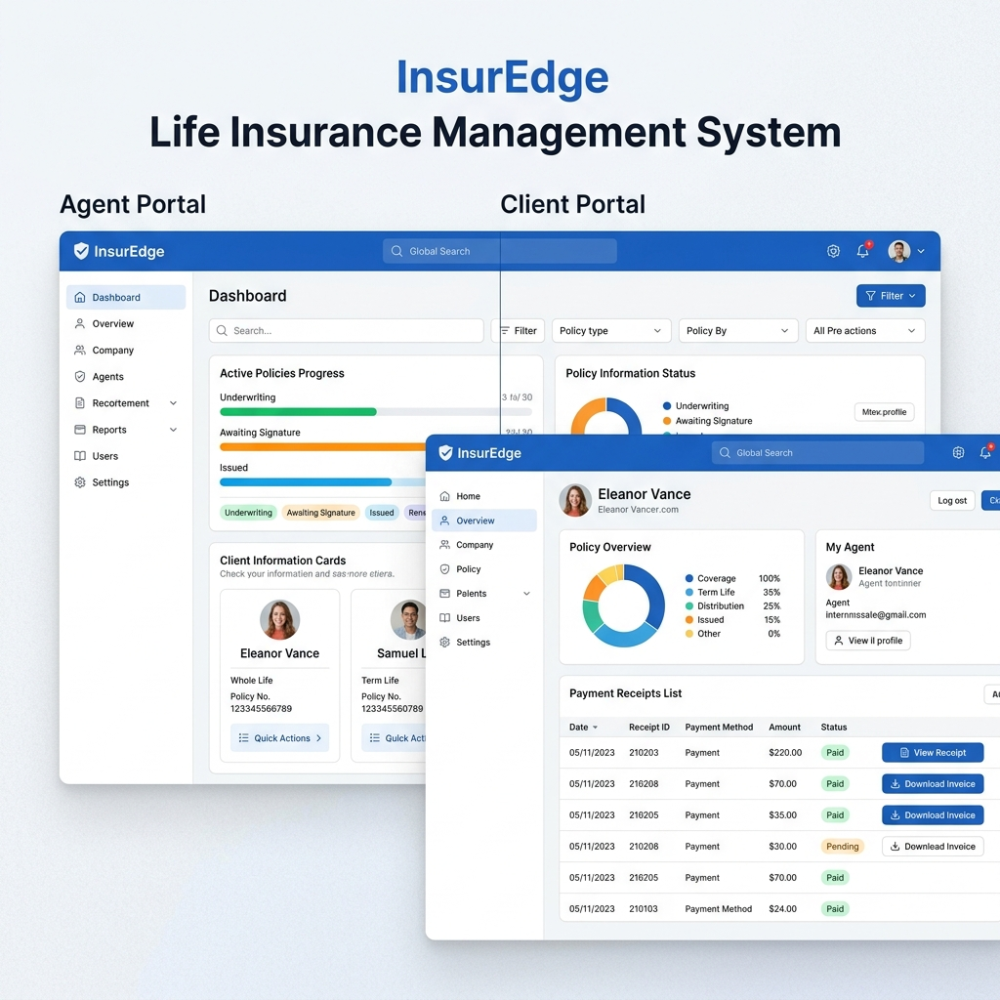
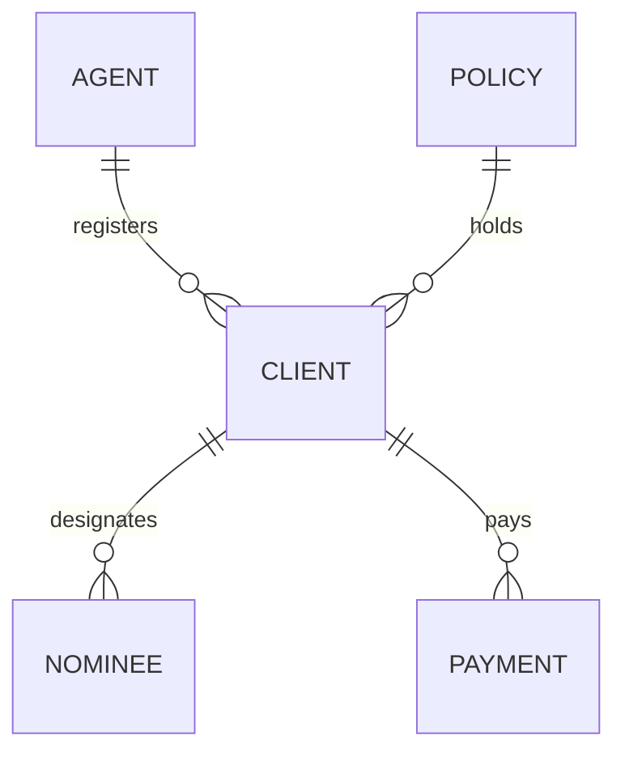

# 🛡️ Life Insurance Management System (LIMS)

<p align="center">
  
</p>

<p align="center">
  <a href="https://www.php.net/"></a>
  <a href="https://www.mysql.com/"></a>
  <a href="LICENSE"></a>
</p>

---

## 📖 Overview

The **Life Insurance Management System (LIMS)** is a web-based portal designed to modernize and simplify operations for life insurance companies. It provides a secure, relational platform for agents, clients, policy lists, nominees, and premium record-keeping.

---

## ✨ Features

- **Multilevel Access Control**: Dedicated interfaces tailored to Master Agents (Admins), Agents, and Clients.
- **Data Segregation**: Agents can only view, edit, or delete records they registered, ensuring information security.
- **Beneficiary Association**: Link nominees with configurable priority rankings and relationship details to active clients.
- **Interactive Payments Ledger**: Keep track of premium payments, due statuses, and dynamically calculated late-payment fines.
- **Print-Ready Receipts**: Generate invoice-like printable receipt vouchers for premium collections.
- **Client Account Access**: Secure client log-in to trace policy benefits, payment histories, and linked nominees.

---

## 🖥️ System Portals & Mockup Previews

### 📊 Dashboard Metrics
A unified control center for managing insurance records, monitoring agent performances, and evaluating monthly transaction tables.
<p align="center">
  
</p>

### 👥 Portal View
The responsive layout split allows agents and clients to view policy configurations, outstanding dues, and active profile cards.
<p align="center">
  
</p>

---

## 📂 Database Architecture & Relational Schema

LIMS leverages five closely linked MySQL tables to maintain complete data integrity:



*   **`agent`**: ID, Password, Name, Branch, Phone.
*   **`client`**: ID, Password, Name, Gender, Birth Date, Marital Status, National ID (NID), Phone, Address, Policy ID, Parent Agent ID, Profile Image Path.
*   **`nominee`**: Nominee ID, Client ID, Name, Gender, Birth Date, NID, Relationship, Priority Rank, Phone.
*   **`policy`**: Policy ID, Terms (duration in years), Health Status Requirements, Payout Percentage.
*   **`payment`**: Receipt Number, Client ID, Month, Amount Paid, Due Balance, Fines, Receiving Agent ID.

---

## 🛠️ Technology Stack

- **Backend Logic**: PHP (relational/procedural scripts)
- **Database Engine**: MySQL / MariaDB
- **User Interface**: HTML5, CSS3, Javascript (responsive Admin Dashboard style elements)

---

## ⚙️ Local Installation & Deployment

Deploy LIMS locally using environments like **XAMPP**, **WampServer**, or **Laragon**:

### 1. Clone the Codebase
Navigate to your local server's document root (e.g., `xampp/htdocs/`) and clone this repository:
```bash
git clone https://github.com/vijaymahes9080/Life-Insurance-Management-System.git
```

### 2. Set Up the Relational Database
1. Launch Apache and MySQL services.
2. Go to **phpMyAdmin** at [http://localhost/phpmyadmin](http://localhost/phpmyadmin).
3. Click **New** and create a database named `lims`.
4. Navigate to the **Import** tab, select the backup file located at `database/lims.sql` in this directory, and click **Import** (or **Go**).

### 3. Establish DB Connection
Open `connection.php` and verify the MySQL connection settings match your setup:
```php
$servername = "localhost";
$username   = "YOUR_DATABASE_USERNAME"; // Defaults to "root" in XAMPP
$password   = "YOUR_DATABASE_PASSWORD"; // Defaults to empty "" in XAMPP
$dbname     = "lims";
```

### 4. Open the Portal
Navigate to the project directory in your browser:
[http://localhost/Life-Insurance-Management-System](http://localhost/Life-Insurance-Management-System)

---

## 🔑 Default Credentials for Evaluation

| Role / Profile | Username | Password |
| :--- | :--- | :--- |
| **Master Agent (Admin)** | `admin` | `12345` |
| **Insurance Agent** | `555` | `666` |
| **Registered Client** | `1511986023` | `123` |
